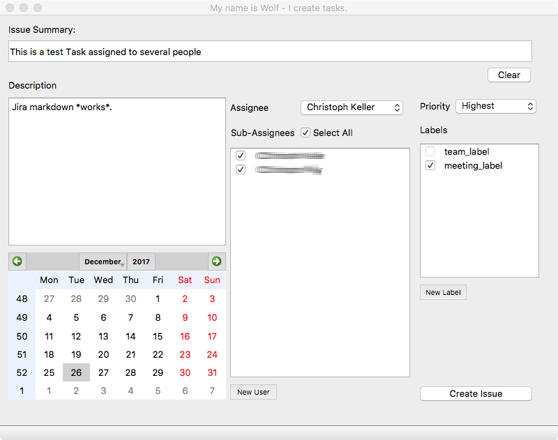
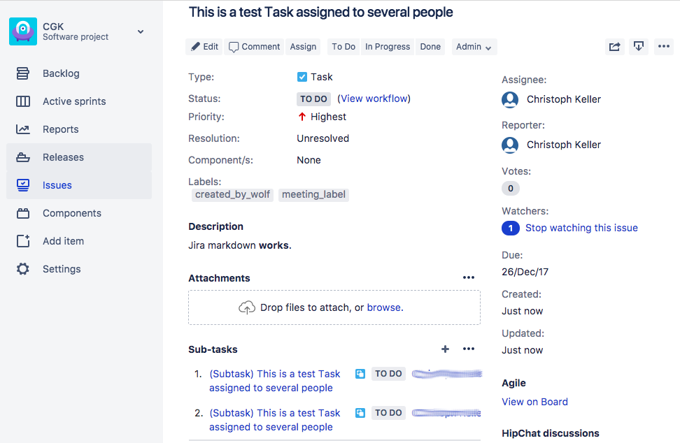
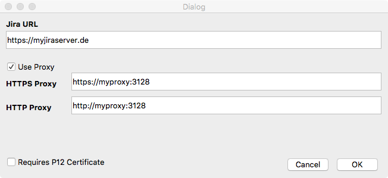
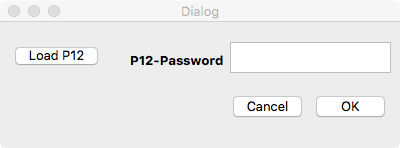
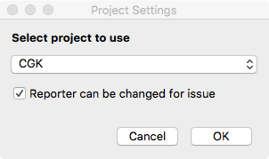
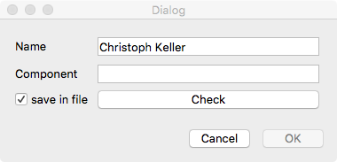

# Introduction

This tool is for creating a task with a subtask to a list of people.
It is supposed to be simple in setup up and use. The tool uses the rest-api and
works with JIRA cloud and server. It is written in python (with QT5) and has been tested on Mac Os X and Windows.

## Use-Case
JIRA does not allow you to assign tasks to a list of people.
With this tool you can create a task and for all assignees a sub-tasks is created.
E.g. a new task "This is an example tasks"  with due-date 2017-12-24 for
users A,B,C can be created and looks

* This is an example tasks (for user A with due-date 2017-12-26)
  * (Sub-Task) This is an example tasks  (for user B with due-date 2017-12-26)
  * (Sub-Task) This is an example tasks  (for user C with due-date 2017-12-26)

### GUI example:

### Result in JIRA:

## Install 

### Windows
Run the script *generate_gui.py* to create all the necessary QT gui classes.
Then start *my_name_is_wof_for_exe.py*.

Or simply use the executable.

### Linux / Mac OS X

Use pip (in the folder)
> pip install .

To run it use:

> python -m my_name_is_wolf

### JIRA
On the jira server make sure you added the due date to the view.
[Due date view configuration.](https://confluence.atlassian.com/jirakb/due-date-field-is-missing-189431917.html)

If you want to be able to change the reporter make sure that the permissions on the sever are correct.
[Managing project permissions](https://confluence.atlassian.com/adminjiraserver073/managing-project-permissions-861253293.html?_ga=2.32665981.2119638840.1514317773-2137838086.1513955264)

## Setup

### Connection settings
Setup your jira server.

If you need a p12 certificate to connect to the server enable the parameter.

### P12 certificate
During startup it will ask you for the p12 key and password. 
This key will be extracted into two files in the current directory:
*mycert-dn.key* and *mycert-dn.crt*. _The keys are not password protected anymore!_

### Project
Select the project to use for reporting.
If the server is configured to change the reporter you can
set the checkbox to use it in the gui.

### Password
Then the program prompts for the jira username and password.
When setting the checkbox the data will be stored (plain text) in the file *my_name_is_wolf.netrc*.
If your password changes simply update or delete the file.
  
### Configs
The file *my_name_is_wolf.ini* contains the general configuration parameters.

### Assignees
The file containing the users is a simple csv format
>\<FirstName1 GivenName1\>, \<Component1\> \
>\<FirstName2 GivenName2\>, \<Component2\>

The default filename is *users.csv*. Each row specifies an assignee. Make sure the names match the Jira display names.
Also make sure that the components exist in the project.

Users can be added via the gui (temporary and permanently).
If the checkbox is not set the user will be not saved and only valid for this session.

# Development

## Setting up conda

Assuming you have already installed anaconda.
Run to create a plain enviroment
> conda create -n my_name_is_wolf_env python=3.6

## Pyinstaller
If you have trouble with pyinstaller check this page:
https://github.com/pyinstaller/pyinstaller/issues/3629

# TODOS
* So much to do but no time ...

# About
&copy; Christoph G. Keller - 2017-08-22